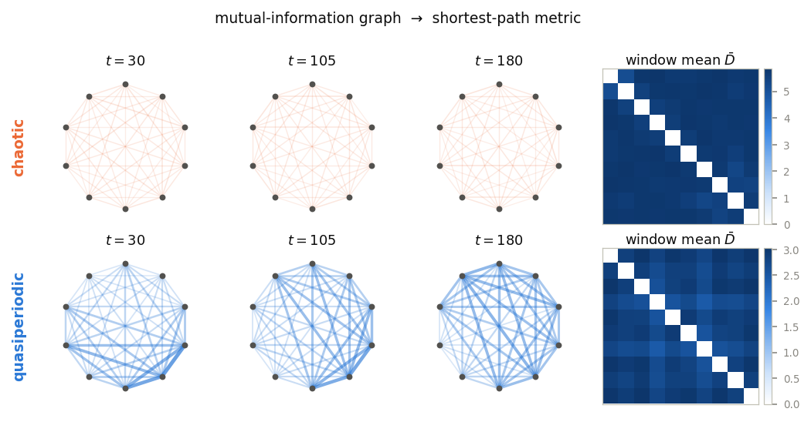
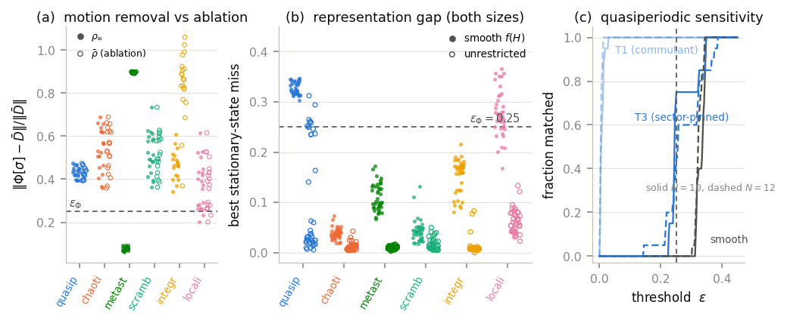
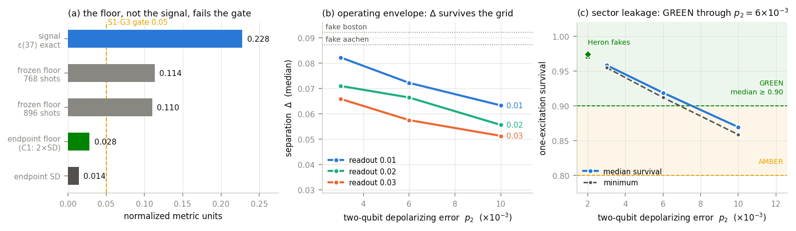

# The price of standing still

**A stable structure sits in front of you. Does it need the motion that made it — or could something frozen have produced it just as well?**

That question is easy to ask and unexpectedly hard to answer. Most claims
that "the dynamics sustains this structure" are never actually confronted
with a serious search for a motionless impostor. This repository is the
complete, commit-hashed record of running that search properly — and of
what happened when the impostor nearly won.

---

## Building a geometry out of correlations

Take a finite quantum spin chain and let it evolve. At every instant,
measure how much information each pair of sites shares, turn that into a
distance — strongly correlated sites are *close*, weakly correlated ones
are *far* — and let the geometry be the shortest paths through that web.

$$w_{ij} = -\ln\!\Big(\frac{I(i{:}j)}{2\ln 2}\Big), \qquad D(t) = \text{all-pairs shortest paths}$$

Average $D(t)$ over a long window and you get $\bar D$: a stable
geometric object distilled out of ceaseless microscopic motion.



*Same pipeline, two different worlds. The chaotic chain (top) scrambles
into a nearly featureless mesh. The quasiperiodic chain (bottom) keeps a
structured, breathing geometry that never settles and never repeats.
Right: the window-averaged metric each one leaves behind.*

Now the test. Search the stationary states — states that **do not move at
all** — for one whose geometry reproduces $\bar D$. Measure the best
one's miss:

$$\varepsilon = \frac{\lVert \Phi[\sigma] - \bar D\rVert_F}{\lVert \bar D \rVert_F}$$

If some frozen $\sigma$ nails it, the motion was incidental. If nothing
does, the structure is something the dynamics actively maintains.

---

## First surprise: averaging doesn't commute with geometry

The obvious impostor is the system's own infinite-time average state —
the thing it "settles into." It fails, and not narrowly: by **36–55%**
across classes at both system sizes.

The reason is simple once seen. Mutual information is *nonlinear* in the
state, so **the geometry of the average is not the average of the
geometry**. Freezing the state destroys something that only exists while
the state is in motion. We checked the two boring explanations — that
it's a finite-window artifact, or an artifact of deleting stationary
degenerate structure — and excluded both.

---

## The real result: the impostor wins, but only by cheating

Push the search harder and something more interesting happens. Every
dynamical class turns out to have *some* stationary impostor. What
separates the classes is **what the impostor has to be allowed to be**.

| dynamical class | impostor that works | miss |
|---|---|---|
| chaotic / scrambling | a thermal window | **≈ 0.04** (as ETH predicts) |
| integrable quench | a generalized Gibbs ensemble | **≈ 0.15** |
| quasiperiodic | any populations in a fixed eigenbasis | **0.23–0.32** — fails |
| quasiperiodic | the **full commutant** of $H$ | **≈ 0.005** — near-perfect |

That last row looked, for a while, like the end of the story: a frozen
state reproduces the moving geometry to half a percent. Fifty times
better than anything else on offer.

Then we asked where that state actually lives.

> The chain conserves total magnetization. The quasiperiodic states we
> evolve are pure one-magnon states — they inhabit a single magnetization
> sector, and the dynamics never leaves it. **The near-perfect impostor
> places about 70% of its weight in sectors the dynamics never visits.**

It isn't beating the moving state. It's changing the subject — buying its
accuracy with structure drawn from a part of Hilbert space the physics
never reaches. Confine it to the sector the system genuinely occupies and
the near-perfect match evaporates, collapsing back to the same
population-only plateau everything else was stuck at (**0.24–0.26**).

**No near-exact sector-admissible impostor of the quasiperiodic metric
was found.** That phrasing is deliberate and load-bearing: a search
returns upper bounds, never impossibility proofs.



*(a) Removing the motion (filled) versus merely ablating stationary
structure (open) — conflating those two was one of the corrections we had
to make. (b) The representation gap across classes at both sizes.
(c) The whole story in one panel: unrestricted (light blue) matches almost
immediately; pinned to the accessible sector (dark blue), it doesn't.*

**And a third instrument points at the same class.** Weak dephasing —
noise that destroys coherence — *stabilizes* the moving quasiperiodic
geometry toward its own average, while destabilizing chaotic-class ones.
The class that resists a stationary impostor is also the class noise
pins down.

---

## Why the small numbers carry the weight

This is a study where the interesting quantities are residuals, and the
gap between 0.005 and 0.24 — a factor of fifty — is the entire finding.
It's also why we are careful rather than triumphant:

The threshold in play, $\varepsilon_\Phi = 0.25$, is a calibrated
finite-size noise floor, and the sector-pinned quasiperiodic results
**straddle it**: 15/20 runs below at $N{=}10$, 9/20 at $N{=}12$. We
report that straddle rather than rounding it into a clean win, because at
this precision the difference between "fails to match" and "marginally
matches" is exactly what a reader should be allowed to judge.

Small residuals decide this question. That cuts both ways, and the record
is built so you can check which way it cut.

---

## Honest limits

A **toy-model, in-model study** on finite chains ($N = 10, 12$). It makes
no claim about gravity, holography, spacetime, universality, or priority.
It is an *instrument* paper: here is a test, here is its first
measurement, here is where it breaks.

**Seven claim-level corrections** were made during this programme — each
caught by the study's own audit mechanisms, each reported as a result. A
preregistered witness scheme failed its own null test and was retired. An
earlier, stronger headline ("only one class resists") did not survive
adversarial review and was replaced by the weaker, truer one you just
read. All of it is in `ar/` and `sessions/`, dated and hash-linked.

---

## Hardware pilot (in progress)

Can this geometry be reconstructed on a real quantum processor? A
preregistered pilot for one registered $N{=}10$ quasiperiodic instance:
1,372 circuits realizing exact evolved snapshots plus the sector-pinned
comparator, every two-site density matrix reconstructed through a
27-setting covering-array tomography, with a 28th all-Z setting as a
sector-leakage witness.



*Local validation, before any quota is spent. (a) The reconstruction
floor: the originally specified statistic (grey) is a full-matrix norm
being compared against a scalar endpoint — it overstates the endpoint's
own uncertainty by 7.8×, which is exactly √(effective metric directions).
(b) The separation survives device-realistic noise. (c) Sector leakage
must be readout-corrected: raw counts read AMBER on a perfectly healthy
device.*

Nothing has been submitted to a QPU. Simulation gates are green; backend
selection and authorization remain. See
`ar/AR-023_hardware-pilot-2026-08-16.md` and `hardware/ibm_exp1/`.

---

## Reproducing

```bash
pip install -e .
pytest tests -q                      # core package
python scripts/make_figures.py all   # regenerate paper figures
```

Campaigns live in `scripts/`, results and manifests under
`results/AR-010/`. Every headline number resolves to a committed evidence
packet in `ar/`.

## How this repo is organised

| path | what it holds |
|---|---|
| `substrate/` | the canonical record: charter, ontology, theory, hypotheses, programme |
| `ar/` | evidence packets — the numbers behind every claim |
| `sessions/` | dated logs, including every correction and why it happened |
| `paper/` | manuscript and figures |
| `src/ideg/` | model, metric, and witness implementations |
| `hardware/ibm_exp1/` | the IBM pilot: circuits, manifests, simulation gates |

Method: the [Shared Substrate](https://github.com/olegroshka/shared-substrate)
discipline (SSRN `10.2139/ssrn.7218019`) — **no result exists until it is
recorded**, every claim resolves to a packet, and negative results are
recorded with the same care as positive ones.

---

**Status:** manuscript complete, preprint posted. For the full argument
read `paper/latex/main.pdf`. To check whether we fooled ourselves, read
`sessions/` — that is where the corrections live, and they are the most
informative thing here.
